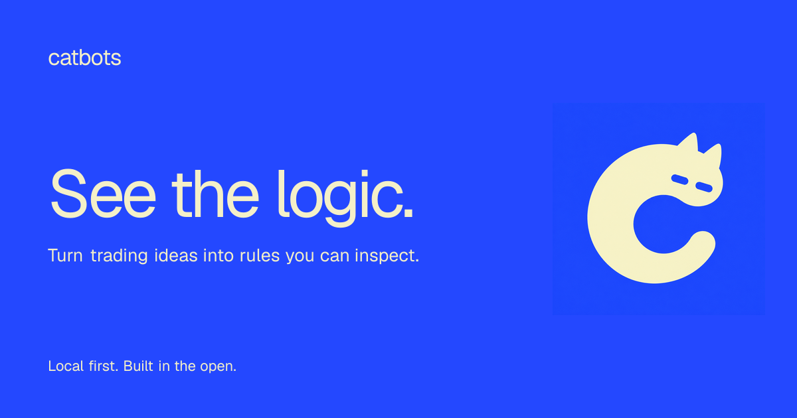

<p align="center">
  
</p>

<p align="center">
  <strong>Build trading bots with AI. Understand every rule.</strong><br />
  A local-first workbench for turning trading ideas into visual strategies you can inspect and backtest.
</p>

<p align="center">
  <a href="#quick-start">Get started</a> ·
  <a href="https://catbots.fun">Website</a> ·
  <a href="docs/user-guide.md">User guide</a> ·
  <a href="https://github.com/catbots-fun/catbots/issues">Feedback</a>
</p>

## One idea. Every rule visible.

Describe the trade you have in mind. Catbots helps turn it into a visual flow, so you can follow the conditions, inspect the actions, and test the strategy before deciding what to run.

- **Build through conversation.** Explain your idea, refine the rules, and compare strategy versions.
- **See how it works.** Follow the triggers, conditions, and actions in a visual graph.
- **Test before deploying.** Review backtest results, dataset coverage, and execution traces.
- **Keep your workspace local.** Bots, configuration, and runtime data live on your computer. You choose the AI provider; chat requests go to that provider.

Catbots currently targets **macOS and Hyperliquid perpetual markets**. It is experimental software with Paper and guarded testnet execution. **Mainnet is disabled.**

## Quick start

The current installation path is **from source**. There is no downloadable GitHub Release yet.

You need **macOS**, **Node.js 22.x**, **pnpm 10.17.1**, and access to a supported AI provider. You do not need exchange credentials to create a strategy and run a backtest.

If pnpm is not installed, install the repository's pinned version after setting up Node.js 22:

```sh
npm install --global pnpm@10.17.1
```

Clone and launch Catbots:

```sh
git clone https://github.com/catbots-fun/catbots.git
cd catbots
pnpm install
pnpm dev
```

The first launch builds the native application. When Catbots opens, connect your AI provider and create your first bot.

### Try your first strategy

1. **Connect AI.** Choose a supported provider's sign-in flow and select **Use for chat**, or enter a compatible API URL, key, and model and select **Connect & continue**.
2. **Create a bot.** Select **Create new bot**, name it, choose **Hyperliquid**, and select **Create draft**.
3. **Describe your idea.** Paste the example below into Chat.
4. **Inspect and test.** Review **Flow**, then **Backtest**. Check the dataset coverage and **By market** results before approving a revision.

```text
Every hour, for ETH-PERP only, open a long when RSI 14 is below 20.
Close that long when RSI is above 80. Do not open shorts.
Backtest the strategy and explain the results.
```

This is an example to explore the workflow, not a recommended trading strategy. The AI can propose and test rules; **you approve the revision and choose whether to deploy it**.

> [!NOTE]
> Starting Paper or testnet initializes a deployment and leaves it waiting. The normal app does not yet include autonomous interval scheduling or market-trigger ingestion. Starting alone does not produce evaluations or orders. See [deployment start and trigger ingestion](docs/dynamic-markets.md#deployment-start-and-trigger-ingestion).

<details>
<summary><strong>Prefer a browser workspace or a UI-only preview?</strong></summary>

From the cloned repository, after `pnpm install`:

| Command | What opens |
| --- | --- |
| `pnpm dev:web` | Real browser workspace with a local Electron backend |
| `pnpm dev:all` | Browser and desktop together, sharing one backend |
| `pnpm dev:preview` | Simulated UI with in-memory demo data; no AI or exchange connection |

For the real browser workspace, open **http://127.0.0.1:5180/** when the terminal prints `Catbots web:`. Keep the backend process running. Use `dev:all` for both surfaces together; do not start separate backends against the same profile.

The preview resets on reload. It does not save credentials, bots, or runtime state. For its address, follow the Vite URL printed in the terminal.

See [running Catbots](docs/user-guide.md#running-catbots) for persistence, lifecycle, and local web details.

</details>

<details>
<summary><strong>Installation troubleshooting</strong></summary>

- **Wrong Node version:** run `node --version`. Catbots requires `v22.x`; newer major versions are not supported by the release tooling.
- **`pnpm` not found:** install the pinned version above, then check `pnpm --version` reports `10.17.1`.
- **Native module compilation fails:** install Apple's Command Line Tools with `xcode-select --install`, then retry `pnpm install` under Node.js 22.
- **Browser port in use:** real web mode requires port `5180`. Stop the process using that port or launch the desktop with `pnpm dev`.
- **AI connection fails:** check the provider URL, credentials, and selected model. See [configuration](docs/user-guide.md#configuration) and [provider sign-in](docs/user-guide.md#subscription-providers-pi).

Still stuck? [Open an issue](https://github.com/catbots-fun/catbots/issues) with your macOS version, Node version, and redacted error output. Never include API keys or wallet private keys.

</details>

## Built for strategies you can inspect

| Capability | What you can explore |
| --- | --- |
| Visual strategy builder | Versioned rules, combined conditions, indicators, and actions |
| Dynamic markets | Focus on one symbol or screen the selected DEX's active perpetual markets |
| Backtesting | Deterministic evaluation, per-market results, and execution traces |
| Paper and testnet | Review deployment scope and risk limits before starting |
| Your AI provider | Compatible API endpoints, local models, and supported provider sign-in flows |
| Community nodes | Install the Funding Filter starter or import reusable subflow manifests |

A bot belongs to one DEX. Add a symbol condition such as `market.symbol = ETH-PERP` when you want to focus on one market. For screeners, each action stays bound to the market being evaluated.

Read the [dynamic-market guide](docs/dynamic-markets.md) or build a reusable node with the [Community Node SDK](docs/architecture/community-node-sdk.md).

## Know what you are running

- **macOS-only for this release.** Windows, Linux, spot, options, and cross-DEX routing are outside the current scope.
- **Testnet only for exchange execution.** Hyperliquid Live mode sends orders to testnet; mainnet is disabled.
- **Bring your own AI access.** Provider terms, model availability, and usage charges apply. Local storage does not mean remote AI requests stay on your device.
- **Use a dedicated Agent/API Wallet for testnet.** Never provide a master-wallet private key. See [configuration and credential handling](docs/user-guide.md#configuration).
- **Backtests are evidence to inspect, not a promise.** Paper and historical results do not predict future performance. Catbots is experimental trading software, not financial advice.

## Build with us

Try a strategy, tell us where the workflow is unclear, or contribute a reusable node. Concrete examples and reproducible bug reports help make Catbots better.

| Start here | What you will find |
| --- | --- |
| [Contributing](CONTRIBUTING.md) | Development setup and engineering boundaries |
| [User guide](docs/user-guide.md) | Configuration, AI providers, local web mode, and architecture |
| [Community Node SDK](docs/architecture/community-node-sdk.md) | Manifest format, authoring, versioning, and limits |
| [Security](SECURITY.md) | How to report vulnerabilities privately |
| [Brand guide](docs/brand/README.md) | Cat-C artwork, colors, and language |

For code changes, use Node.js 22 and run the relevant tests, then the full checks:

```sh
pnpm typecheck
pnpm test
pnpm test:e2e
git diff --check
```

The E2E suite packages Electron and manages native module rebuilding. Stop separate Electron development processes before running it.

### Source and license

Catbots is built in the open. **An open-source license has not yet been selected**, so reuse permissions are not granted automatically. See the source, try the workflow, and join the discussion as the project develops.

<p align="center"><strong>Curious by design. Clear by choice.</strong></p>
