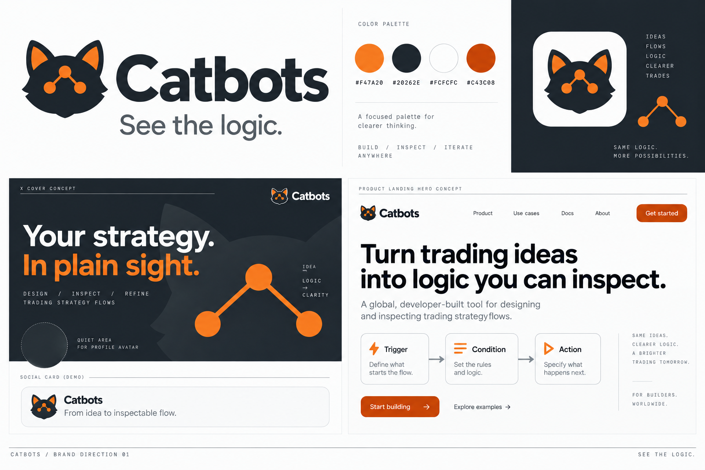

# Catbots brand direction

11 September 2026 · Global audience · Design proposal

## แนวคิดหลัก

**See the logic.**

Catbots ทำให้ไอเดียการเทรดกลายเป็นกฎที่มองเห็น ตรวจสอบ และทดสอบได้ ความชัดเจนคือเหตุผลที่คนควรจำแบรนด์ ส่วนแมวเป็นสัญลักษณ์ที่ช่วยให้จำได้ง่าย

Positioning: **A local-first workbench for trading strategies you can inspect.**

กลุ่มหลักคือผู้ใช้ Hyperliquid ที่มีไอเดียกลยุทธ์และอยากเข้าใจการทำงานของบอต กลุ่มรองคือนักพัฒนาที่สนใจเครื่องมือทดสอบและกลยุทธ์ที่ตรวจสอบได้ ใช้ภาษาอังกฤษสำหรับเนื้อหาสาธารณะและตัวอย่างผลิตภัณฑ์

## บุคลิก

| คุณลักษณะ | สิ่งที่ผู้ใช้ควรเห็น |
| --- | --- |
| Precise | บอกว่ากฎทำอะไร มีเงื่อนไขและขอบเขตอะไร |
| Transparent | แสดง logic, assumptions, limitations และค่าธรรมเนียม |
| Approachable | ประโยคสั้น ตัวอย่างชัด แมวที่จำง่าย |
| Builder-led | เดโมจากงานจริง เหตุผลในการออกแบบ และความคืบหน้าที่ตรวจได้ |

ให้ความเป็นแมวอยู่ที่เครื่องหมายและภาพประกอบเล็ก ๆ ใช้ภาษาตรงไปตรงมาในหน้าความเสี่ยง การอนุมัติ และค่าธรรมเนียม

## ชื่อและเครื่องหมาย

- เขียนชื่อ **Catbots** เสมอ หลีกเลี่ยง CatBots, Cat Bots และ CATBOTS ในข้อความทั่วไป
- ต่อยอดเครื่องหมายเดิม: หัวแมวสี charcoal, ใบหูสีส้ม และโหนดสามจุดที่เชื่อมกัน
- ใช้รูปแบบแบนสำหรับงานดิจิทัล เพื่อให้ภาพชัดเมื่อย่อเล็ก
- เครื่องหมายเดี่ยวใช้กับ avatar, app icon และ favicon; เครื่องหมายคู่ชื่อใช้กับเว็บไซต์ เดโม และเอกสาร
- ใช้พื้นที่ว่างรอบโลโก้อย่างน้อยเท่ากับเส้นผ่านศูนย์กลางของโหนดหนึ่งจุดในโลโก้
- ขนาดตั้งต้น: เครื่องหมาย 32 px ขึ้นไป; ที่ 16–24 px ต้องตรวจความชัดก่อนใช้และอาจต้องมีรุ่นลดรายละเอียด
- บนพื้น charcoal ให้วางโลโก้ในพื้นรอง off-white เพื่อคงความชัดของหัวแมว
- ไม่ยืด บิด หมุน เติมตา เติมเหรียญ หรือเปลี่ยนโครงข่ายในโลโก้แต่ละชิ้นงาน

ไฟล์ `apps/desktop/assets/icon.svg` เป็นซอร์สเวกเตอร์เดิม ภาพ brand board เป็นแนวทางการจัดองค์ประกอบ ไม่ใช่ซอร์สสำหรับตัดโลโก้ไปใช้งานจริง และยังไม่ได้เปลี่ยนโลโก้ในแอป

## สี

| Role | Hex | Usage |
| --- | --- | --- |
| Cat Orange | #F47A20 | โลโก้ จุดเน้น เส้นเชื่อม และภาพประกอบ |
| Charcoal | #20262E | ตัวหนังสือหลัก พื้นเข้ม และหัวแมว |
| Off-white | #FCFCFC | พื้นหลังหลักและพื้นรองเครื่องหมาย |
| Light Gray | #F0F0F0 | พื้นรอง กล่องตัวอย่าง และพื้นที่แบ่งส่วน |
| Action Orange | #C43C08 | ปุ่มและองค์ประกอบ UI ที่ต้องการสีเข้มกว่า artwork |

สัดส่วนตั้งต้นสำหรับสื่อ: neutral 75%, charcoal 20%, orange 5% ปรับได้ตามพื้นหลัง ไม่ใช่ข้อบังคับทางคณิตศาสตร์

ให้สีส้มเป็นจุดนำสายตา ไม่ใช้สีส้มกับทุกองค์ประกอบ ตัวหนังสือยาวใช้ charcoal บน off-white และใช้ข้อความสีขาวกับปุ่ม Action Orange หลีกเลี่ยงตัวหนังสือสีขาวขนาดเล็กบน Cat Orange

สีแบรนด์แยกจากความหมายของสถานะ: ผลกำไร/ขาดทุน ข้อผิดพลาด และสถานะเตือนต้องมีข้อความหรือไอคอนประกอบ อย่าใช้สีส้มแทนทุกสถานะ

## ตัวอักษรและรูปทรง

- คง system sans ของผลิตภัณฑ์: `-apple-system, BlinkMacSystemFont, "Segoe UI", sans-serif` เพื่อให้เข้ากับแอปปัจจุบัน
- สื่อและเอกสารที่ต้องส่งข้ามเครื่องใช้ Arial เป็นตัวเลือกตั้งต้น; wordmark ในภาพเป็นแนวทางสัดส่วน ยังไม่ได้กำหนด custom font
- ใช้ system monospace เช่น SFMono-Regular หรือ Menlo เฉพาะชื่อกฎ ตัวเลข และ label ทางเทคนิค
- หัวเรื่องใช้ semibold/bold, body ใช้ regular, จัดชิดซ้าย และเว้นระยะให้ภาพ flow อ่านง่าย
- จำกัดภาพแต่ละชิ้นไว้ที่หัวเรื่องหนึ่งประเด็นและหลักฐานหนึ่งชิ้น
- ใช้เส้นเชื่อม โหนด และกรอบกฎเป็นองค์ประกอบกราฟิกประจำแบรนด์ การเชื่อมต่อในภาพสาธิตต้องตรงกับ logic จริง

## ข้อความหลักภาษาอังกฤษ

**Tagline**

See the logic.

**Website headline**

Turn trading ideas into logic you can inspect.

**Supporting sentence**

Describe a strategy, review its flow, and backtest the rules before taking the next step.

**Campaign headline**

Your strategy. In plain sight.

**Demo card**

From idea to inspectable flow.

**CTA options**

Watch the demo · Explore the flow · Read the docs · Try the workbench

ใช้ CTA ให้ตรงกับสิ่งที่ลิงก์ปลายทางทำได้จริง ตรวจสถานะ release ก่อนใช้คำว่า Run, Live หรือ Mainnet

## น้ำเสียง

| Context | Preferred copy | Avoid |
| --- | --- | --- |
| แนะนำผลิตภัณฑ์ | Build a strategy you can inspect. | Let AI print money for you. |
| เดโม | Here is how this rule becomes a flow. | The smartest trading bot ever. |
| Backtest | This result uses the assumptions shown below. | Proven to beat the market. |
| ความคืบหน้า | This version supports… | Everything is ready. |
| ข้อจำกัด | Mainnet is disabled in this release. | Safe and risk-free. |
| ค่าธรรมเนียม | Review the builder fee before approving it. | Completely free, when trading fees apply. |

เขียนในฐานะคนสร้างที่อธิบายงานของตัวเอง แสดงตัวอย่างและข้อจำกัด ใช้คำว่า AI เมื่ออธิบายหน้าที่ของมันอย่างเฉพาะเจาะจง

## X ส่วนตัวและบัญชีผลิตภัณฑ์

บัญชีส่วนตัวใช้รูปคุณเป็น avatar เพื่อเชื่อมตัวตนกับประสบการณ์ Blockchain Developer ส่วนบัญชี Catbots ใช้เครื่องหมายแมว

**Personal bio draft**

Blockchain developer building Catbots. Trading ideas, inspectable logic, and lessons from building in public.

**Product bio draft**

Trading strategies you can inspect. Local-first workbench for Hyperliquid. See the logic.

Bio เป็นข้อความวางตำแหน่งแบรนด์ ส่วนสถานะทดลองและข้อจำกัดให้อธิบายชัดใน pinned post และหน้าปลายทาง

**Cover composition**

พื้น charcoal, ข้อความ Your strategy. In plain sight., เครื่องหมายเล็ก และโหนดสีส้ม ใช้กรอบทำงานอัตราส่วน 3:1 เก็บข้อความสำคัญห่างขอบและเว้นพื้นที่ล่างซ้ายสำหรับ avatar ตรวจ crop ในหน้าพรีวิว X ทั้งมือถือและเดสก์ท็อปก่อนเผยแพร่

**Pinned post opening**

I'm a blockchain developer building Catbots: a local-first workbench for turning trading ideas into strategy flows you can inspect and backtest. I'm sharing the demos, design decisions, and lessons as I build.

ต่อด้วยเดโม สถานะรุ่นปัจจุบัน และคำชวนที่ทำได้จริงหนึ่งอย่าง

## รูปแบบคอนเทนต์ประจำแบรนด์

| Format | Structure |
| --- | --- |
| Product demo | หัวเรื่องสั้น / ภาพหน้าจอจริงที่อ่านได้ / กฎที่กำลังอธิบาย / CTA |
| Build note | สิ่งที่เปลี่ยน / เหตุผล / หลักฐานก่อนและหลัง |
| Strategy explainer | ไอเดีย / flow / assumptions / สิ่งที่ควรตรวจ |
| Release note | รุ่นหรือวันที่ / สิ่งที่ทำได้ / ข้อจำกัด / ลิงก์รายละเอียด |

ใส่โลโก้ตำแหน่งสม่ำเสมอและใช้สีส้มกับจุดที่ต้องการให้ดู อย่าเอาภาพ mockup ของ brand board ไปใช้เป็นหลักฐานว่าฟีเจอร์นั้นเปิดใช้งานแล้ว

## Open source และรายได้

ความโปร่งใสของโมเดลรายได้เป็นส่วนหนึ่งของแบรนด์ อธิบายว่าโปรเจกต์เปิดให้ตรวจอะไร ใช้ license ใด และผู้ใช้จ่ายค่าอะไร

README ที่ตรวจในวันที่ 11 September 2026 ยังระบุว่าไม่ได้เลือก open-source license และ mainnet ยังปิด ดังนั้นข้อความเกี่ยวกับสองเรื่องนี้ต้องตรวจอีกครั้งก่อนเผยแพร่ ใช้สถานะจริงของ release เป็นหลัก

**Funding copy while planned**

I plan to support Catbots development through disclosed Hyperliquid builder fees when mainnet trading is available. The fee will be shown before approval.

เมื่อเปิดใช้จริง ให้แสดงอัตราจริง ตัวอย่างจำนวนเงิน และวิธีจัดการการอนุมัติ แยกค่า AI provider, exchange fee และ builder fee ให้เข้าใจได้

## Deliverables and source

- `brand-direction-01.png`: ภาพรวม identity และตัวอย่างการใช้สำหรับทบทวน
- `brand-guide.md`: แนวทางชื่อ สี ข้อความ น้ำเสียง และการใช้บน X
- `image-prompt.txt`: prompt ของ brand board สร้างด้วย built-in image generation
- Existing source: `apps/desktop/assets/icon.svg`, `icon-source.png`, renderer design tokens, and README

ภาพ mockup เป็น concept; ค่าสีและข้อความในคู่มือนี้เป็นข้อกำหนดสำหรับนำไปทำไฟล์จริงต่อไป การออกแบบครั้งนี้ไม่ได้แก้ UI, โพสต์ลง X หรืออัปเดต Google Sheets
